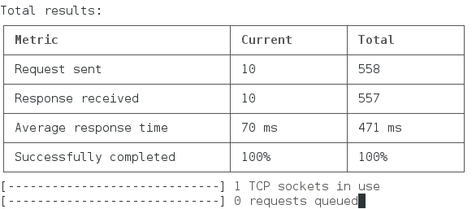
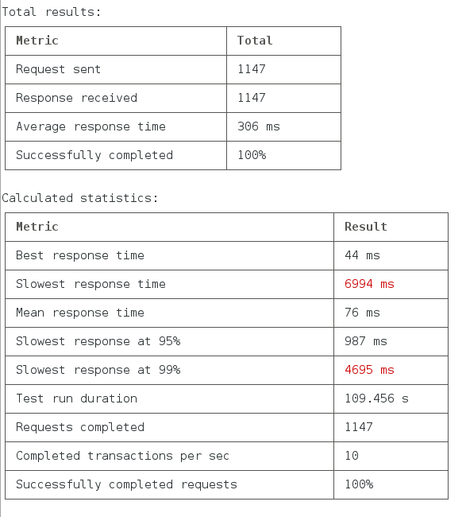

# Loadtester - load test your web application

Loadtester is a simple lib you can use to quicly build a stress testing
script for your application.

## Usage

Add loadtester lib to your application:
```
npm install loadtester
```

Call it from your code in the following way:
```javascript
var LoadTester = require('loadtester').LoadTester;
var consoleUI = require('loadtester').consoleUI;

// create a LoadTester with minimal parameters
var myLoadTester = new LoadTester({
  url: "http://localhost/my/app/to/test",
  requestPerSec: 10,
});
// start the load test
myLoadTester.start();
// print progress to the console (and refresh every second).
setInterval(function () {
  consoleUI.printStatsPage(myLoadTester.stats());
}, 1000);

// Exit on CTRL+C and display detailed stats
process.on('SIGINT', function () {
  myLoadTester.stop();
  consoleUI.printStatsPage(myLoadTester.stats(true));
  process.exit();
});

```

The output of your script would look someting like this:



This will show you some key metrics from the last 1 sec (shown as Current)
and in total. Metrics are the following:
* **Request sent**: The number of request sent by the `LoadTester`. Normally this
is very close or equals to the one you requested in the `requestPerSec` parameter.
* **Response received**: How many responses have been received and processed.
* **Average response time**: The average of the response times calculated on
the received responses.
* **Successfully completed**: How many of the responses have been completed
successfully. By default, any response with HTTP 200 status code will be
considered successful and any non 200 response will be considered as failed.

Additionally, you can track how many TCP sockets are in use by the loadtester.
By default HTTP keep-alive is used, and the socket pool size will be set to
`3 * requestPerSec` - so this is the maximum of parallel HTTP connections your
service will be hit by.

In case the loadtester tries to send more requests that are being processed and
it cannot allocate a free socket to the request, it will be queued. This queue
size is normally 0 or close to 0 and is displayed in the second gauge.

Hit CTRL+C and you should see a summary like this:



Apart from the same metrics being displayed for the overall execution of the
test, the following statistics are being calculated:
* **Best response time**: The fastest response time we could measure.
* **Slowest response time**: the slowest response time we measured. Note that
my default requests will timeout if TCP connection cannot be opened within 10
secs or once the TCP connection is ready, there is another timeout for the
completion of the request (which is again 10 secs).
* **Mean response time**: The mean response time during the measurement.
* **Slowest response at 95%**: The slowest response time of the fastest 95% of
the completed requests. In other words, in 95% the service response time is
better than this.
* **Slowest response at 99%**: Similar as above, measured at 99%.
* **Test run duration**: Total run time of the measurement.
* **Requests completed**: The number of requests completed in the measurement
period.
* **Completed transactions per sec**: This is the actual transaction rate the
service could provide. Normally this is close to or equals to the requested
`requestPerSec`, but it can be lower if the server, network or the test machine
cannot handle the load.
* **Successfully completed requests**: Successfully completed requests in total.

## Options
Options you can use.

### LoadTester object
You can set the following parameters in the options object that is being passed
when you create a new LoadTester:
* `url`: Either a simple string URL to send the requests to or a `function(){}`
  that can be called without parameters and will return a string URL. Mandatory.
* `requestPerSec`: A positive number indicating the requested transaction rate.
The loadTester will start this many requests to the target server. Mandatory.
* `requestGenerator`: A `function(){}` that will be called each time a new
  request is constructed. It shall return a string or an object that will be
  used as a request body. If this is set, the request method will be `POST` by
  default. This is an optional parameter.
* `responseCallback`: A `function(req, resp, counterIncreaseFn){}` that will
  be called once a response is received. You can use this callback to verify
  the response it OK and can be considered as successful. If you return false
  in this callback, the response will be considered as failed.
  Furthermore, the third param of this callback is a function you can use to
  set up your own metric. Ie. if you want to measure the "empty" responses,
  you can call it like `counterIncreaseFn("responseEmpty", 1);`. In this
  case *responseEmpty* will be added to your metrics.

### Human friendly formatting
Calling `loadtester.stats()` will give you an object which can be displayed
as a JSON. But if you want a more human friendly output, you can use the
`consoleUI` helpers to render nice tables. You have the following functions:
* `formatStatsTable(stats)`: returns a string you can print to the console.
The table will contain the data you can see in the first screenshot.
* `formatFinalStatsTable(stats)`: returns a string you can print to the
console. The table will contain the data you can see in the second screenshot.
* `printStatsPage(stats)`: This will display and update the latest stats data
in the console's standard output.
